# PedroT-SIEM-Deployment

# Sprint 11 Project Plan Proposal
# Building a SIEM Lab: From Deployment to Detection
## My Journey Into SIEM

When I first started learning cybersecurity, I quickly realized that understanding security concepts was only part of the process.

I wanted to see what actually happens when a system is attacked.

What does an attack look like in the logs?

How does a security analyst recognize suspicious activity?

And more importantly, how do you connect multiple events together to understand what actually happened?

That led me to build my own Security Information and Event Management (SIEM) lab using **Wazuh, Sysmon, and Windows**.

This project became more than just deploying a SIEM. It became an investigation into how endpoint telemetry can be collected, analyzed, and turned into a story.

---

## The Goal

The goal of this project was to build a working SIEM environment and use it to investigate simulated security activity.

I wanted to go beyond simply installing the tools.

I wanted to understand the complete process:

**Generate activity → Collect telemetry → Analyze events → Identify suspicious behavior → Build the timeline**

This project gave me an opportunity to practice the same type of thinking used by security analysts when investigating events inside a SIEM.

---

## The Environment

For this lab, I built an environment consisting of:

- **Wazuh** – SIEM and security monitoring platform
- **Windows** – Endpoint generating security telemetry
- **Sysmon** – Detailed Windows system and process monitoring
- **Command-line activity** – Used to generate observable events
- **GitHub** – Documentation and project portfolio

The purpose was to create a controlled environment where I could generate activity and then investigate what appeared in the SIEM.

---

## Starting the Investigation

Once the environment was running, the next question was simple:

> **Would I actually be able to see the activity I generated?**

That became the focus of the investigation.

I generated activity on the Windows endpoint and then moved into Wazuh to examine the telemetry.

At first, the individual events didn't necessarily tell the entire story.

The real value came from connecting the events together.

That is where the investigation became interesting.

# Modification🦾 
I wanted to practice and apply what I learned during Sprint 11 about registering, adding, and deploying Wazuh agents. I selected the Atomic Red Team (ART) Workstation because it was not currently registered in Wazuh. Adding this workstation would expand the monitored environment and allow Wazuh to recognize it as an endpoint.
The security benefit of this modification is that the ART Workstation can now be identified and monitored as part of the Wazuh environment. This will also provide a dedicated endpoint for my later Atomic Red Team experiments.
I first identified the type of machine I was working with by opening the system information on the ART Workstation. I confirmed that the machine is running Windows Server 2022 Standard and is hosted in VMware.
ipconfig
This allowed me to identify the network configuration of the ART Workstation.
The investigation provided the following information:
 

Next, I moved to the Wazuh-SIEM server and ran:
hostname -I
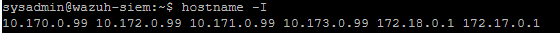 
This command displayed the IP addresses associated with the Wazuh server. Because multiple addresses were listed, I needed to determine which address could be reached from the ART Workstation.
From the ART Workstation, I tested the Wazuh server addresses using ping. The address that successfully responded was:

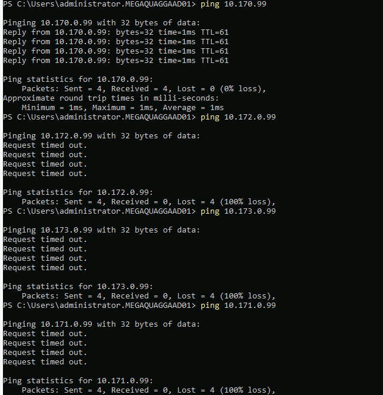 

Wazuh Manager: 10.170.0.99
The ART Workstation successfully reached 10.170.0.99, while the other addresses tested were not reachable from the ART Workstation.

I learned from the Wazuh agent enrollment documentation that Wazuh uses specific TCP ports for agent communication and enrollment. Ping alone was not enough to confirm that the services required by Wazuh were reachable.
I used PowerShell to test the required ports:
Test-NetConnection 10.170.0.99 -Port 1514
The result was:

I then tested the enrollment port:
Test-NetConnection 10.170.0.99 -Port 1515
The result was also:

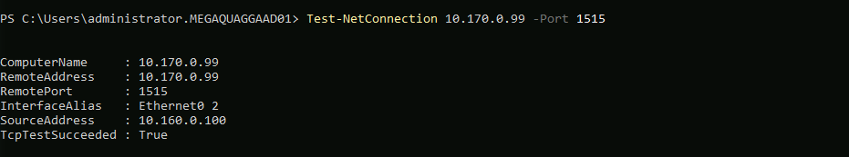 

                                So far i have  ART VM - TCP 1514 -  Wazuh Manager 

Before installing the agent, I checked the Wazuh Manager version to make sure I used the appropriate agent version.
On the Wazuh-SIEM server, I ran:
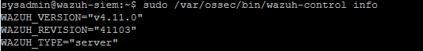 

This confirmed that the Wazuh Manager was running version 4.11.0.
I also checked the currently registered agents using:

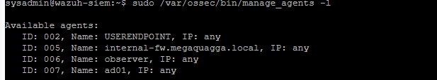 

This confirmed that the ART Workstation was not already registered with the Wazuh Manager.

I then opened the Wazuh Dashboard and navigated to:
Agent Management  - Summary  - Deploy New Agent
I selected the Windows operating system, entered the Wazuh Manager address, and assigned the agent the name:
ARTWorkstation
The Wazuh Dashboard then provided the PowerShell installation command for the Windows agent.

During the first attempt, I mistakenly ran the Windows installation command on the Linux-based Wazuh-SIEM server. This resulted in command-not-found errors because the installation command was intended to be executed in Windows PowerShell.

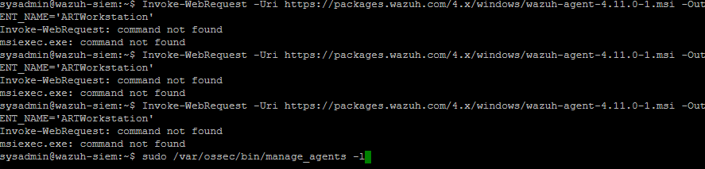 

After identifying the mistake, I returned to the ART Workstation and ran the installation command in PowerShell on the correct Windows machine.

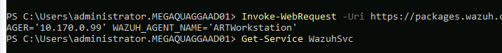 

After installing the Wazuh agent on the ART Workstation, I started the Wazuh service using:
Start-Service WazuhSvc
I then verified the service status with:
Get-Service WazuhSvc
The service reported a Running status, confirming that the Wazuh agent was active on the ART Workstation.

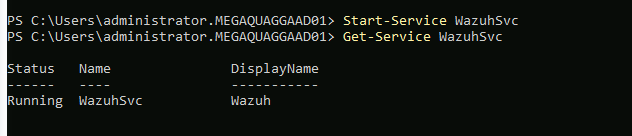 

Finally, I returned to the Wazuh Dashboard and refreshed the agent list.
The ART Workstation appeared as:

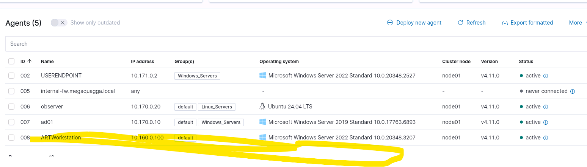 

This confirmed that the ART Workstation was successfully enrolled in the Wazuh environment and was now part of the monitored endpoints.
The expected outcome of this modification was that the ART Workstation would successfully enroll with the Wazuh Manager and appear as an actively monitored endpoint. The endpoint should remain connected to the Wazuh Manager and be available within the Wazuh Dashboard for future monitoring and investigation.
The modification is considered successful when:
The ART Workstation can communicate with the Wazuh Manager.
TCP ports 1514 and 1515 are reachable from the ART Workstation.
The Wazuh agent installs successfully on the ART Workstation.
The ART Workstation successfully enrolls with the Wazuh Manager.
The endpoint appears in the Wazuh Dashboard as ARTWorkstation.
The Wazuh agent reports an Active status.

References to use while implementing
## References to Use While Implementing

- [Wazuh agent - Installation guide · Wazuh documentation](https://documentation.wazuh.com/current/installation-guide/wazuh-agent/index.html?utm_source=chatgpt.com)
- [Deploying Wazuh agents on Windows endpoints - Wazuh agent](https://documentation.wazuh.com/current/installation-guide/wazuh-agent/wazuh-agent-package-windows.html?utm_source=chatgpt.com)
- [How to Find Your IP Address From CMD (Command Prompt)](https://www.howtogeek.com/858334/how-to-find-your-ip-address-from-cmd-command-prompt/)
- [How to Find IP Address in Linux Command Line](https://linuxhandbook.com/find-ip-address/) 

# 🔬 Experiment #1

I selected T1053.005-4 — PowerShell Cmdlet Scheduled Task to evaluate how my SIEM detects scheduled task activity. Scheduled tasks can be used by adversaries to execute programs automatically and, depending on how they are configured, can also support persistence. This made the technique relevant to endpoint monitoring and detection validation.
I also wanted to determine whether the scheduled-task telemetry generated on the ART Workstation was visible in Wazuh.
I used the ART Workstation because Atomic Red Team was already installed on this system and the lab instructions recommended using it to safely perform these types of tests.
The purpose of this experiment was not to simulate a random attack, but to deliberately execute a known MITRE ATT&CK technique and then determine what evidence was generated by the endpoint and what evidence was visible in my SIEM.
Using Atomic Red Team gives me several known variables:
A known MITRE ATT&CK technique
A known test
A known start time
A known end time
A known expected behavior
Evidence that I can compare against my SIEM
This allows me to perform a controlled detection-validation experiment.
I ran:
Invoke-AtomicTest T1053.005 -ShowDetailsBrief
And ART showed me 12 different tests for T1053.005.

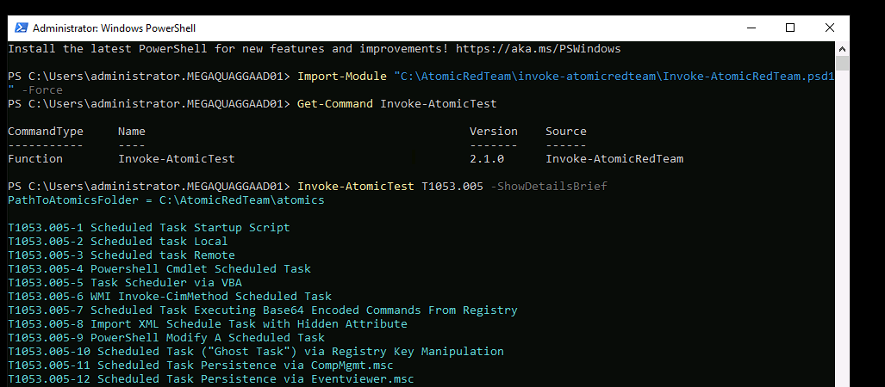 
For my experiment i selected:
T1053.005-4
I ran:
Invoke-AtomicTest T1053.005-4 -CheckPrereqs
ART returned:
Prerequisites met
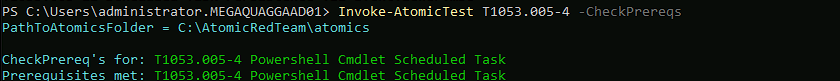 

This means the environment had what the test needed.
i did this before executing the test because  i didnt wanted to get confuse and assume it didn't work 

I ran:
Get-Date and recorded:

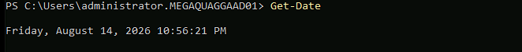 

I know exactly when the experiment happened.
I ran - Invoke-AtomicTest T1053.005-4

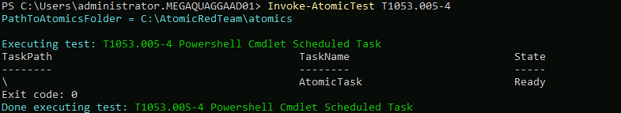 

Exit code: 0 It means the ART test completed successfully. 
Immediately afterward, I ran Get-Date again to know the end time of the test.

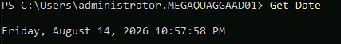 

I  went back to my Blue Team workstation where  Wasuh Siem dashboard is located  → Discover Then we filtered for: agent.name = ARTWorkstation
Because there were multiple systems generating logs.

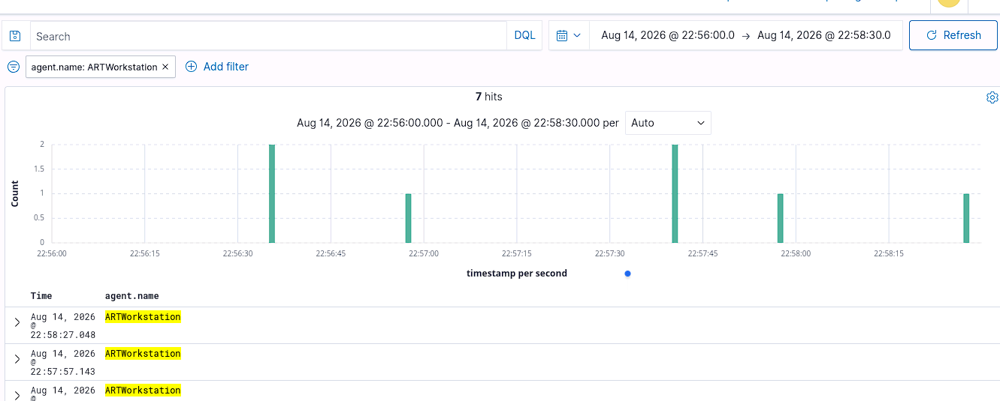 

10:56:00 PM → 10:58:30 PM because I couldn't  actually figure out how to adjust the milliseconds but I got close to it. Our actual test was: 10:56:21 → 10:57:58
The larger window helps prevent us from accidentally missing events because of small timestamp differences or processing delays.
I got 7 results after doing so  with the vent ID 16384 - software protection service scheduled successfully but the results were not from Atomic Red or related.It was normal Windows activity. From that I learned something very important: An event occurring during your investigation window does not automatically mean it belongs to your investigation.That's correlation.

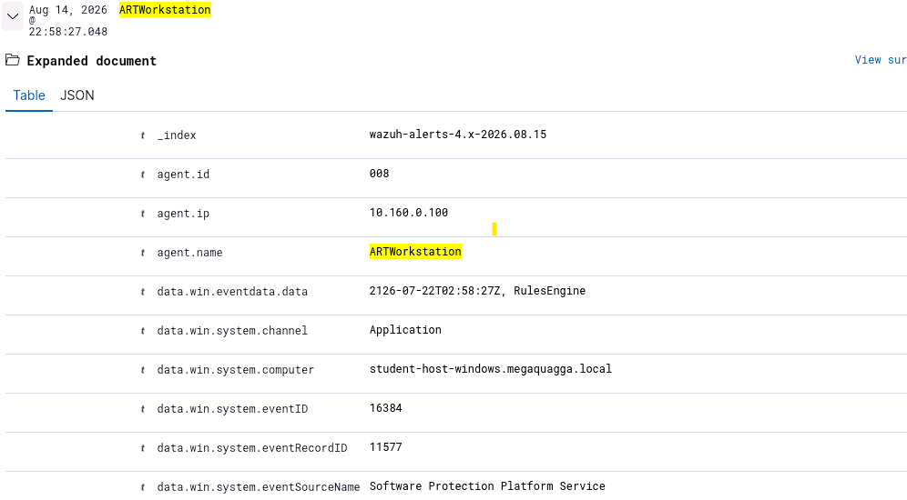 

There was another vent under ID 4616 that said The system time was changed got my attention because it has a severity but after looking at the logs it shows was altered by
C:\Program Files\VMware\VMware Tools\vmtoolsd.exe

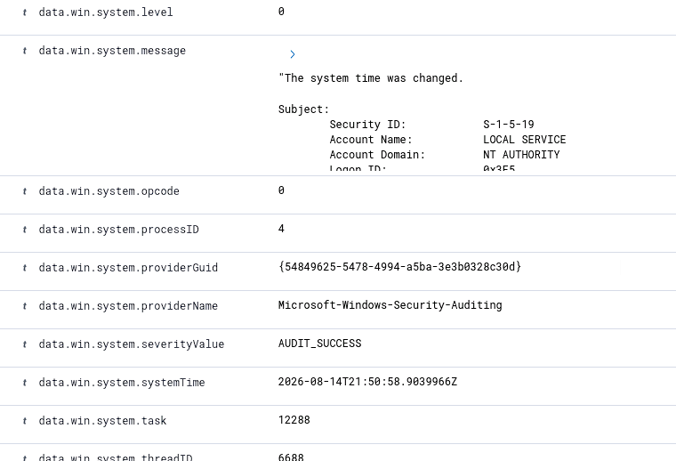 

That made sense because the machine is running inside a virtualized CloudShare environment.
But still no telemetry from my attack test to answer my questions. Who did it? What process? What happened? What evidence supports the conclusion?
Since Wasuh did not collect those logs I decided to view windows event logs on Artworkstation. I remember that if the  event log did not detect sysmon it would not either. I kind of worked backwards. I should have done that first but  I did tho lol.
If the endpoint never generated the event, there's nothing for Wazuh to collect.
So we went to the source of truth: Windows Event Viewer.
Event Viewer → Windows Logs → Security
did not find  event ID 4698 since i did not find none there i checked the Task Scheduler since that was the attack i did anyways. This was the turning point.
Event Viewer → Applications and Services Logs → Microsoft → Windows → TaskScheduler → Operational
And BOOM. 🔥

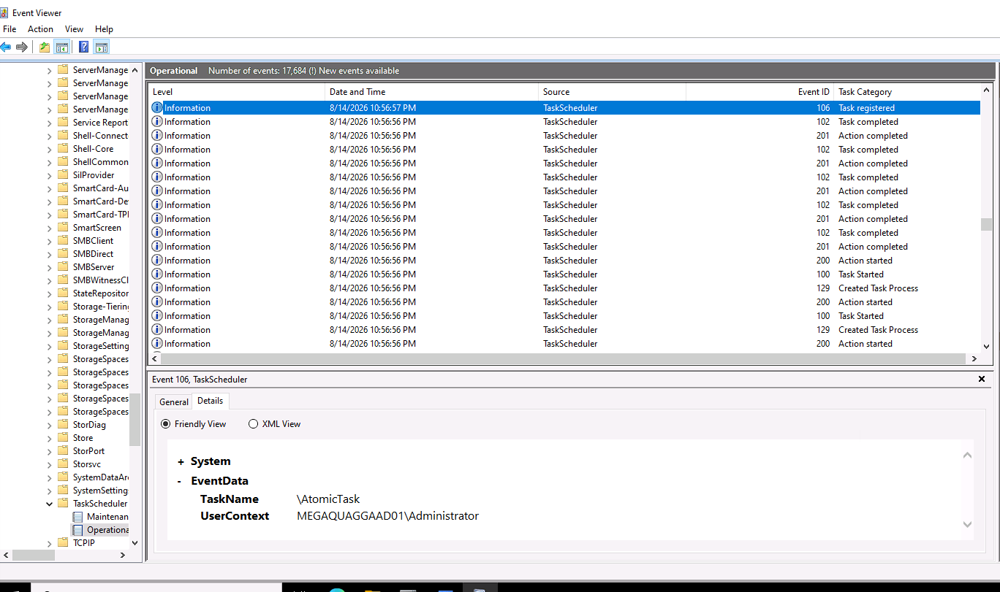 

Now  I can see telemetry directly associated with scheduled-task activity.
I view details on Event ID 106.

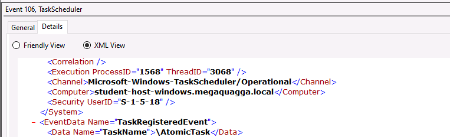 

Now I have multiple independent pieces of evidence: My ARTWORKSTATION says: T1053.005-4 
Windows Task Scheduler says: Event 106 — Task registered Windows says: TaskName = \AtomicTask Windows says UserContext = MEGAQUAGGAAD01\Administrator Timestamp says: 10:56:57 PM Experiment says:Started 10:56:21 PM
Now the big question i asked my self WHY Wasuh dont see this telemetry
I went back to Wazuh. And searched: agent.name = ARTWorkstation and data.win.system.eventID = 106 during: 10:56:00 → 10:58:30 Result: No results match your search criteria Then i searched for: AtomicTask Result: No records

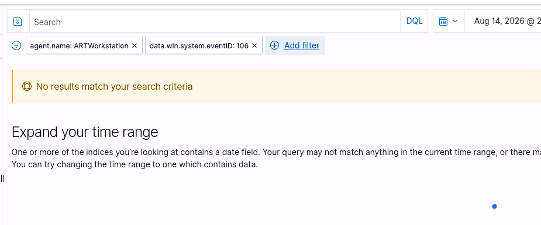 
I can confidently say:
Windows recorded the scheduled-task activity, but the corresponding Event ID 106 and AtomicTask value were not visible in the Wazuh alerts index during the experiment window.
 i decided to check if  Sysmon is present because it does not make sense yet WHY
I ran Get-Service Sysmon*  returned nothing. Then:
Get-Win Event -ListLog *Sysmon* returned:No matching event log.
Therefore: Sysmon was not available on ARTWorkstation. I was planning to installed but No because my test has been performed already and it could change my environment,

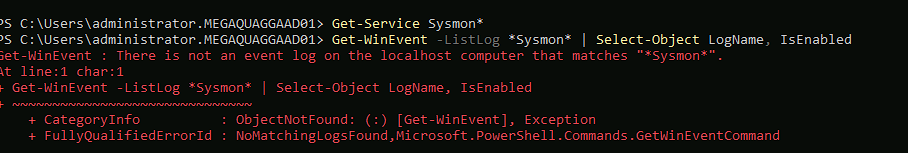 

Just incase you lost this is what has been done so far
Loaded the Invoke-AtomicRedTeam PowerShell module.
Confirmed that T1053.005 contained multiple atomic tests.
Selected T1053.005-4.
Checked the test prerequisites.
Recorded the experiment start time.
Executed the atomic test.
Recorded the experiment end time.
Searched Wazuh for ARTWorkstation activity during the experiment window.
Examined the Windows Security and Task Scheduler logs directly on the endpoint.
Compared endpoint telemetry against Wazuh telemetry.That's a solid methodology.
Actual result

# Actual result
Atomic Red Team successfully executed T1053.005-4 and created AtomicTask. Windows Task Scheduler recorded Event ID 106 showing that \AtomicTask was registered under the MEGAQUAGGAAD01\Administrator context at approximately 10:56:57 PM. However, searching the Wazuh alerts index for Event ID 106 and AtomicTask during the experiment window returned no records.
The experiment identified a potential visibility gap between the endpoint's Task Scheduler telemetry and the events available in the Wazuh alerts index. The endpoint clearly recorded the scheduled-task registration, but the corresponding event was not visible in Wazuh during the test window.
Finish up by cleaning my test 

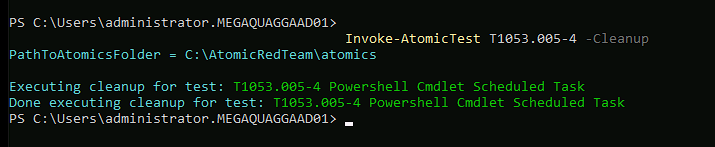 

### References to Use While Conducting

- [Wazuh agent - Installation guide · Wazuh documentation](https://documentation.wazuh.com/current/installation-guide/wazuh-agent/index.html?utm_source=chatgpt.com)
- [Deploying Wazuh agents on Windows endpoints - Wazuh agent](https://documentation.wazuh.com/current/installation-guide/wazuh-agent/wazuh-agent-package-windows.html?utm_source=chatgpt.com)
- [How to Find Your IP Address From CMD (Command Prompt)](https://www.howtogeek.com/858334/how-to-find-your-ip-address-from-cmd-command-prompt/)
- [How to Find IP Address in Linux Command Line](https://linuxhandbook.com/find-ip-address/)
- TripleTen Sprint 11 project instructions

# 🔬 Experiment #2

For this experiment, I decided to execute a Process Injection test using MITRE ATT&CK T1055.011 (Extra Window Memory Injection) from the Atomic Red Team framework. My goal was to see what telemetry my SIEM actually captures, check if the activity stands out from normal behavior, and evaluate our visibility into process-injection techniques.
Since I already had my terminal open, I initiated an SSH session to my target VM (ad01) using PowerShell remoting (New-PSSession), authenticating as the administrator to bridge the network gap.

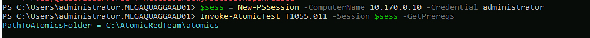 

Once prerequisites were checked, I invoked test T1055.011, which attempts to inject code into extra window memory. I made sure to note my timestamps around 10:13 PM and 10:14 PM so I could track down the related logs in Wazuh. 

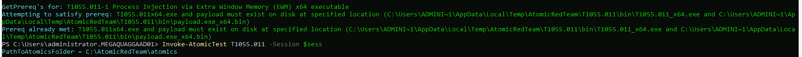 

Checking my Wazuh dashboard within that timeframe, I didn't see a flood of advanced memory injection logs, but I did capture three critical log indicators confirming activity took place:
Event ID 4624 & 4672 (Security Log): Proved the successful remote administrative logon to the target host.
Sysmon Event ID 11 (File Create): Captured temporary policy scripts (__PSScriptPolicyTest_*.ps1) dropped by PowerShell in the AppData\Local\Temp folder.
Wazuh Rule 92213 (Critical Level 15): Flagged the temporary file drop under MITRE ATT&CK T1105 (Ingress Tool Transfer).

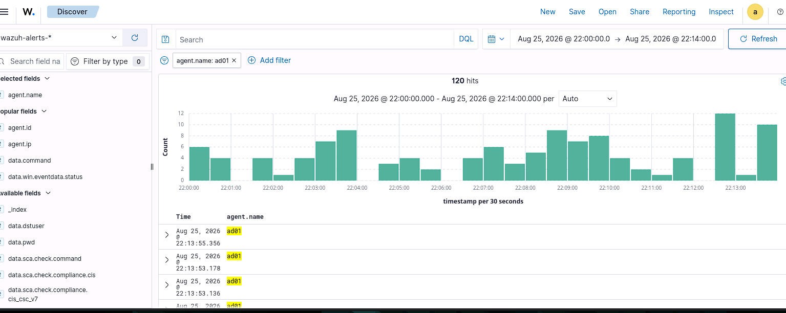 
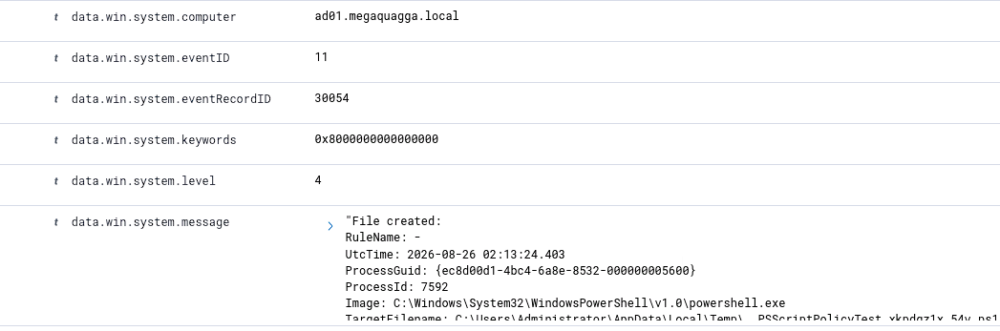 
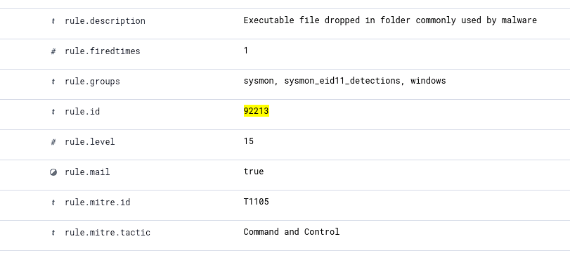 

At first, I was a little confused because I expected to see deep memory-related events (like Event ID 8) in the local Event Viewer. When I double checked the local logs and found no other relevant events for that timeframe, it taught me a valuable lesson: assuming "no logs mean nothing happened" is a trap.
These three file creation events in the temp directory don't tell the full story on their own. In a real world investigation, this is only the starting point further analysis, such as reviewing PowerShell script block logging or tuning Sysmon configuration profiles, would be required to fully map the behavior.
 Once I finished collecting my evidence, I immediately ran the cleanup command to return the environment to its clean state before wrapping up my notes.

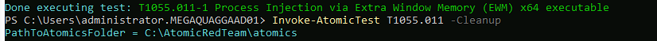 

### References to Use While Implementing

- [MITRE ATT&CK - Process Injection: Extra Window Memory Injection (T1055.011)](https://attack.mitre.org/techniques/T1055/011/?utm_source=chatgpt.com)
- [Atomic Red Team - GitHub](https://github.com/redcanaryco/atomic-red-team?utm_source=chatgpt.com)
- [Wazuh Agent - User Manual](https://documentation.wazuh.com/current/user-manual/agent/index.html?utm_source=chatgpt.com)

# 🔬 Experiment #3

For this final experiment, I simulated an Ingress Tool Transfer (MITRE ATT&CK T1105) using the Atomic Red Team framework on our target VM (ad01). My objective was to validate whether Wazuh and Sysmon provide enough comprehensive telemetry covering process creation, command-line execution, network connections, and file handling to successfully investigate a tool download event. 
Utilizing my active remote PowerShell session ($sess), I executed Test #7, which leverages the native Windows binary certutil.exe to pull down a file from an external repository: 

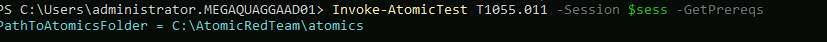 
 

certutil -urlcache -split -f [https://raw.githubusercontent.com/redcanaryco/atomic-red-team/master/LICENSE.txt](https://raw.githubusercontent.com/redcanaryco/atomic-red-team/master/LICENSE.txt) Atomic-license.txt 
Start Timestamp: August 29, 2026 @ 14:04:00
End Timestamp: August 29, 2026 @ 14:06:00

 

Filtering my Wazuh dashboard for agent.name: ad01 during the test window yielded a high-fidelity trail of 67 total hits, confirming that living-off-the-land binaries (LOLBins) generate distinct, highly detectable telemetry when monitored correctly: 

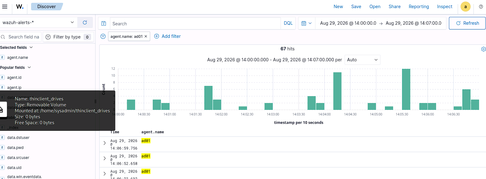 

You can see the activity spikes right in your test timeframe (around 14:04 to 14:06), which lines up perfectly with when you executed the certutil download test.
Filtering my Wazuh dashboard for agent.name: ad01 during the test window yielded a high fidelity trail of 67 total hits, confirming that living-off-the-land binaries (LOLBins) generate distinct, highly detectable telemetry when monitored correctly: 

Process Creation (Sysmon Event ID 1): Captured cmd.exe spawning and passing the exact certutil arguments, exposing the parent-child relationship and command-line parameters (parentCommandLine).

Network Activity (Sysmon Event ID 3): Logged the outbound network connection generated as certutil reached out to the external GitHub URL to retrieve the payload.
Authentication & Session Logs: Tracked administrative access tokens (4634, 4672) corresponding to the remote management window.

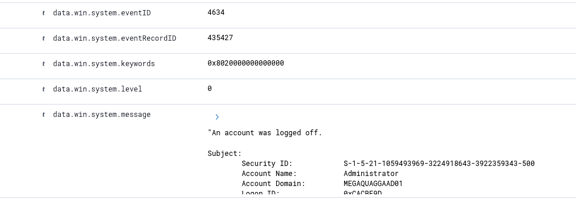 
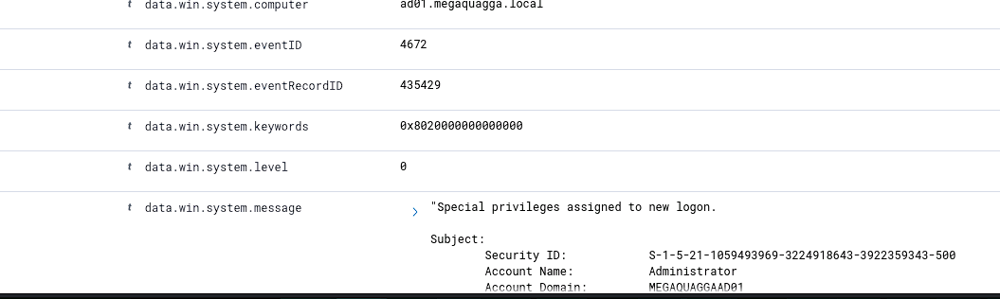 
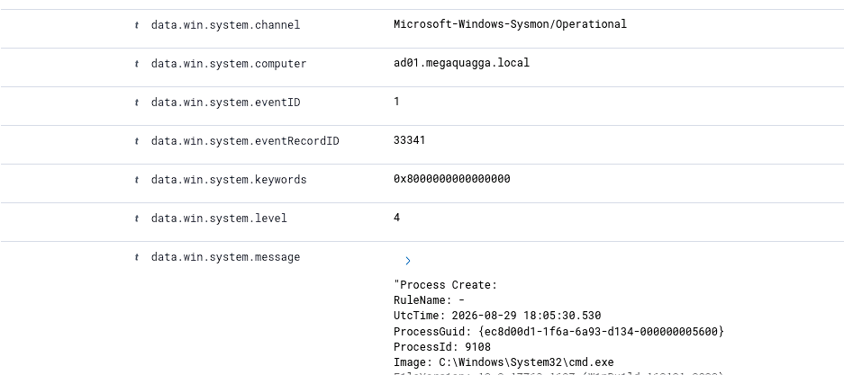 
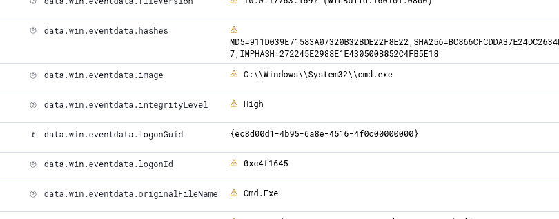 
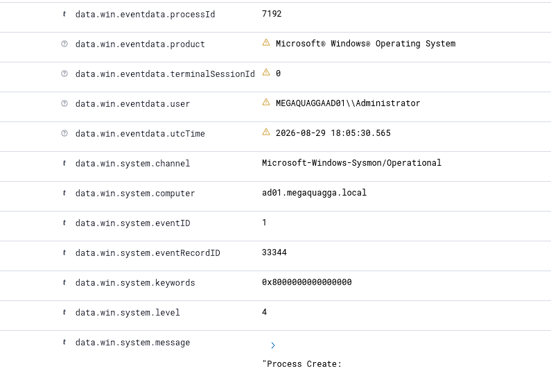 
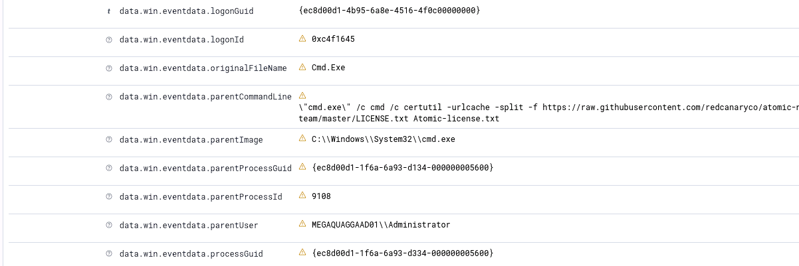 
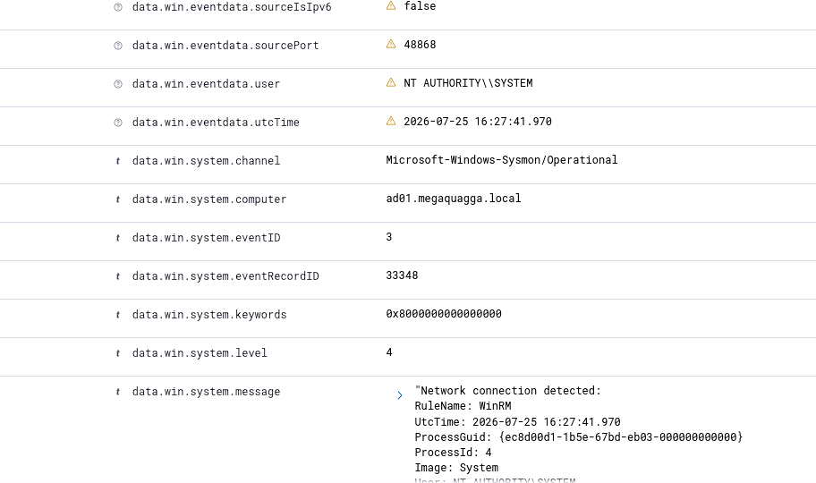 

SIEM and Sysmon combination provides outstanding visibility into tool transfer techniques. By correlating the parent process, command line arguments, and network telemetry, an analyst can easily reconstruct how a file was downloaded, what utility was abused, and where the connection went.
I wrapped up the test by running the cleanup command 
Invoke-AtomicTest T1105 -TestNumbers 7 -Cleanup -Session $sess

### References to Use While Implementing

- [MITRE ATT&CK - Ingress Tool Transfer (T1105)](https://attack.mitre.org/techniques/T1105/?utm_source=chatgpt.com)
- [Atomic Red Team - GitHub](https://github.com/redcanaryco/atomic-red-team?utm_source=chatgpt.com)
- [Wazuh Agent - User Manual](https://documentation.wazuh.com/current/user-manual/agent/index.html?utm_source=chatgpt.com)

