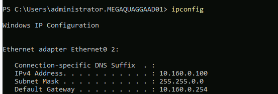

# PedroT-SIEM-Deployment

# Sprint 11 Project Plan Proposal
# Building a SIEM Lab: From Deployment to Detection
## My Journey Into SIEM

When I first started learning cybersecurity, I quickly realized that understanding security concepts was only part of the process.

I wanted to see what actually happens when a system is attacked.

What does an attack look like in the logs?

How does a security analyst recognize suspicious activity?

And more importantly, how do you connect multiple events together to understand what actually happened?

That led me to build my own Security Information and Event Management (SIEM) lab using **Wazuh, Sysmon, and Windows**.

This project became more than just deploying a SIEM. It became an investigation into how endpoint telemetry can be collected, analyzed, and turned into a story.

---

## The Goal

The goal of this project was to build a working SIEM environment and use it to investigate simulated security activity.

I wanted to go beyond simply installing the tools.

I wanted to understand the complete process:

**Generate activity → Collect telemetry → Analyze events → Identify suspicious behavior → Build the timeline**

This project gave me an opportunity to practice the same type of thinking used by security analysts when investigating events inside a SIEM.

---

## The Environment

For this lab, I built an environment consisting of:

- **Wazuh** – SIEM and security monitoring platform
- **Windows** – Endpoint generating security telemetry
- **Sysmon** – Detailed Windows system and process monitoring
- **Command-line activity** – Used to generate observable events
- **GitHub** – Documentation and project portfolio

The purpose was to create a controlled environment where I could generate activity and then investigate what appeared in the SIEM.

---

## Starting the Investigation

Once the environment was running, the next question was simple:

> **Would I actually be able to see the activity I generated?**

That became the focus of the investigation.

I generated activity on the Windows endpoint and then moved into Wazuh to examine the telemetry.

At first, the individual events didn't necessarily tell the entire story.

The real value came from connecting the events together.

That is where the investigation became interesting.

# Modification🦾 
I wanted to practice and apply what I learned during Sprint 11 about registering, adding, and deploying Wazuh agents. I selected the Atomic Red Team (ART) Workstation because it was not currently registered in Wazuh. Adding this workstation would expand the monitored environment and allow Wazuh to recognize it as an endpoint.
The security benefit of this modification is that the ART Workstation can now be identified and monitored as part of the Wazuh environment. This will also provide a dedicated endpoint for my later Atomic Red Team experiments.
I first identified the type of machine I was working with by opening the system information on the ART Workstation. I confirmed that the machine is running Windows Server 2022 Standard and is hosted in VMware.
ipconfig
This allowed me to identify the network configuration of the ART Workstation.
The investigation provided the following information:
 

Next, I moved to the Wazuh-SIEM server and ran:
hostname -I
This command displayed the IP addresses associated with the Wazuh server. Because multiple addresses were listed, I needed to determine which address could be reached from the ART Workstation.
From the ART Workstation, I tested the Wazuh server addresses using ping. The address that successfully responded was:

Wazuh Manager: 10.170.0.99
The ART Workstation successfully reached 10.170.0.99, while the other addresses tested were not reachable from the ART Workstation.

I learned from the Wazuh agent enrollment documentation that Wazuh uses specific TCP ports for agent communication and enrollment. Ping alone was not enough to confirm that the services required by Wazuh were reachable.
I used PowerShell to test the required ports:
Test-NetConnection 10.170.0.99 -Port 1514
The result was:

I then tested the enrollment port:
Test-NetConnection 10.170.0.99 -Port 1515
The result was also:

                                So far i have  ART VM - TCP 1514 -  Wazuh Manager 

Before installing the agent, I checked the Wazuh Manager version to make sure I used the appropriate agent version.
On the Wazuh-SIEM server, I ran:

This confirmed that the Wazuh Manager was running version 4.11.0.
I also checked the currently registered agents using:

This confirmed that the ART Workstation was not already registered with the Wazuh Manager.

I then opened the Wazuh Dashboard and navigated to:
Agent Management  - Summary  - Deploy New Agent
I selected the Windows operating system, entered the Wazuh Manager address, and assigned the agent the name:
ARTWorkstation
The Wazuh Dashboard then provided the PowerShell installation command for the Windows agent.

During the first attempt, I mistakenly ran the Windows installation command on the Linux-based Wazuh-SIEM server. This resulted in command-not-found errors because the installation command was intended to be executed in Windows PowerShell.

After identifying the mistake, I returned to the ART Workstation and ran the installation command in PowerShell on the correct Windows machine.

After installing the Wazuh agent on the ART Workstation, I started the Wazuh service using:
Start-Service WazuhSvc
I then verified the service status with:
Get-Service WazuhSvc
The service reported a Running status, confirming that the Wazuh agent was active on the ART Workstation.

Finally, I returned to the Wazuh Dashboard and refreshed the agent list.
The ART Workstation appeared as:

This confirmed that the ART Workstation was successfully enrolled in the Wazuh environment and was now part of the monitored endpoints.
The expected outcome of this modification was that the ART Workstation would successfully enroll with the Wazuh Manager and appear as an actively monitored endpoint. The endpoint should remain connected to the Wazuh Manager and be available within the Wazuh Dashboard for future monitoring and investigation.
The modification is considered successful when:
The ART Workstation can communicate with the Wazuh Manager.
TCP ports 1514 and 1515 are reachable from the ART Workstation.
The Wazuh agent installs successfully on the ART Workstation.
The ART Workstation successfully enrolls with the Wazuh Manager.
The endpoint appears in the Wazuh Dashboard as ARTWorkstation.
The Wazuh agent reports an Active status.

References to use while implementing
Wazuh agent - Installation guide · Wazuh documentation 
Deploying Wazuh agents on Windows endpoints - Wazuh agent 
How to Find Your IP Address From CMD (Command Prompt) 
How to Find IP Address in Linux Command Line 

